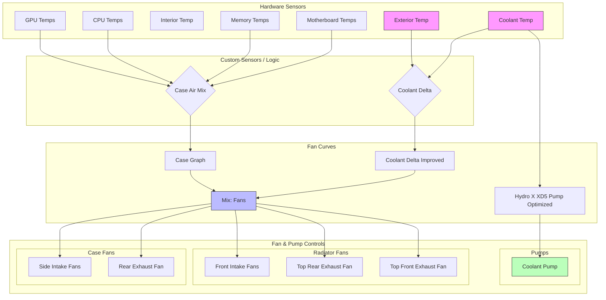

# FanControl Config

This is a repository for my personal fanControl configuration files.

```mermaid
graph TD
    %% Sensors
    subgraph Sensors [Hardware Sensors]
        S1[Coolant Temp]
        S2[Exterior Temp]
        S3[Interior Temp]
        S4[Motherboard Temps]
        S5[Memory Temps]
        S6[CPU Temps]
        S7[GPU Temps]
    end

    %% Custom Sensors (Mixes)
    subgraph Mixes [Custom Sensors / Logic]
        M1{Coolant Delta}
        M2{Case Air Mix}
    end

    %% Curves
    subgraph Curves [Fan Curves]
        C1[Coolant Delta Improved]
        C2[Case Graph]
        C3[Mix: Fans]
        C4[Hydro X XD5 Pump Optimized]
    end

    %% Controls
    subgraph Controls [Fan & Pump Controls]
        subgraph Pumps [Pumps]
            F1[Coolant Pump]
        end
        subgraph RadiatorFans [Radiator Fans]
            F3[Front Intake Fans]
            F4[Top Rear Exhaust Fan]
            F5[Top Front Exhaust Fan]
        end
        subgraph CaseFans [Case Fans]
            F2[Side Intake Fans]
            F6[Rear Exhaust Fan]
        end
    end

    %% Relationships
    S1 --> M1
    S2 --> M1
    M1 --> C1
    
    S4 --> M2
    S5 --> M2
    S6 --> M2
    S7 --> M2
    M2 --> C2

    C1 --> C3
    C2 --> C3
    
    C3 --> F2
    C3 --> F3
    C3 --> F4
    C3 --> F5
    C3 --> F6
    
    S1 --> C4
    C4 --> F1

    %% Styling
    style S1 fill:#f9f,stroke:#333
    style S2 fill:#f9f,stroke:#333
    style C3 fill:#bbf,stroke:#333
    style F1 fill:#bfb,stroke:#333
```
